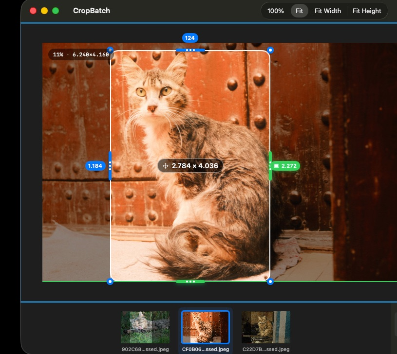

# Cropping

There are two ways to set the crop, and they stay in sync:

- **Drag the handles** on the image preview to pull each edge inward.
- **Scrub the T / B / L / R labels** (top, bottom, left, right) — drag left/right on a label to change that edge's value precisely.

## Aspect ratio guides

Use **View ▸ Aspect Guide** to overlay a ratio while you crop: 16:9, 4:3, 1:1, 9:16, 3:2, or 21:9. The guide is a visual aid — it doesn't force the crop.

## Adjusting from the keyboard

| Shortcut | Action |
| --- | --- |
| ⇧ + Arrow | Adjust the crop by 1px |
| ⇧⌃ + Arrow | Adjust by 10px |
| ⇧⌥ + Arrow | Uncrop (expand the edge back out) |

## Reset

**Crop ▸ Reset Crop** (⌘R) clears all four edges and returns to the full image.
