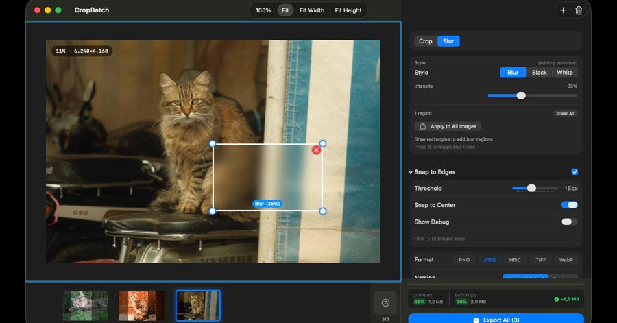
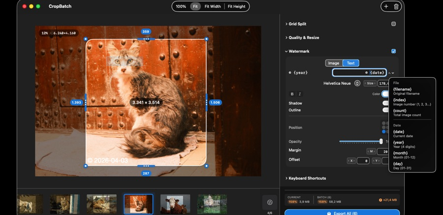

# Corner Radius, Blur & Watermark

CropBatch can apply finishing effects to every image in the batch.

## Corner Radius

Round the corners of the output, with per-corner control. Because rounded corners need transparency, enabling this **auto-switches the export format to PNG**.

## Blur Regions

Blur sensitive areas — redact names, faces, keys, or anything you don't want to share. Each blur region has an adjustable **intensity**. Toggle the blur tool with the **B** key.

## Watermarks

Overlay **text or an image** on every export. Options include:

- Position and opacity
- Color, shadow, and outline
- Variables (e.g. file name) in text watermarks

Watermarks are applied to the final cropped image, so they sit correctly on the output you actually keep.
