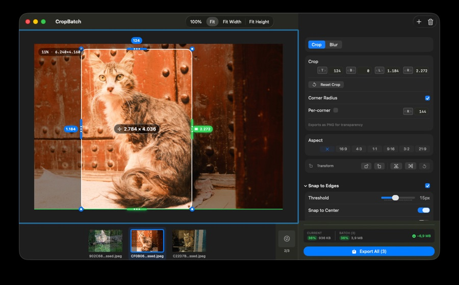

# Getting Started

CropBatch crops many images at once with the same settings. A typical session is four steps:

1. **Import** — Drag images onto the window, or choose **File ▸ Import Images…** (⌘O).
2. **Crop** — Drag the handles on the preview, or scrub the **T / B / L / R** labels to trim each edge.
3. **Configure** — Pick the output format, naming, grid split, and resize options in the settings panel.
4. **Export** — Click **Export All**, or use **File ▸ Export…** (⇧⌘E), to save every image with your settings.

## Tips

- Crop settings apply to **all imported images**, so you can trim a whole batch of screenshots identically.
- Use **Image ▸ Previous / Next** (⌘↑ / ⌘↓) to step through the batch and check each result.
- Turn on **View ▸ Show Before/After** (⌘B) to compare the original and the crop.
