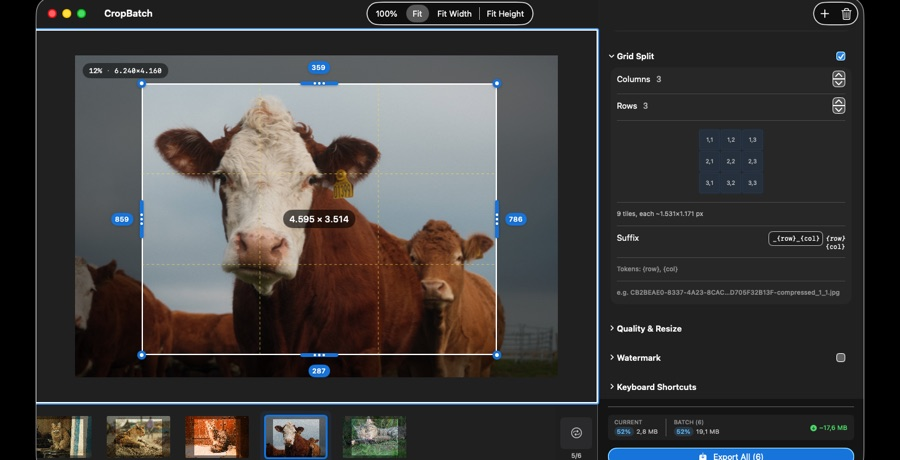

# Grid Split

Grid Split divides each cropped image into a grid of tiles — useful for slicing a large image into evenly sized pieces.

1. Set the number of **rows** and **columns**.
2. Each output image is cut into `rows × columns` tiles.
3. Tiles are named with a configurable pattern so they stay in order.

Grid Split runs **after** the crop, so you slice exactly the region you kept.
