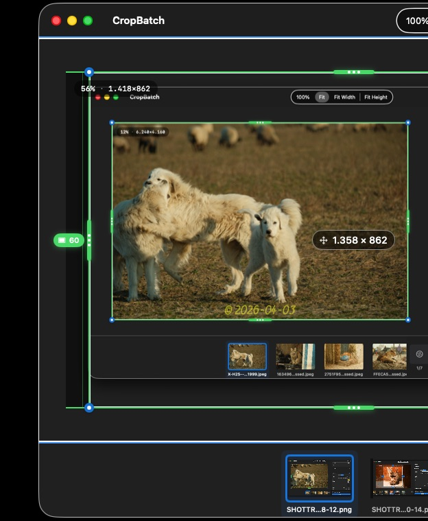

# Snap-to-Edge

When cropping screenshots, the crop handles can **snap to detected element boundaries** — window chrome, toolbars, panels, and other UI edges — so you can trim tightly without pixel-hunting.

- Toggle snapping with the **S** key.
- Drag a handle near a detected edge and it will lock onto it.

This is especially useful for cleaning up app screenshots where you want to cut exactly at a sidebar or title bar.

## Debugging detection

If snapping isn't catching the edge you expect, the edge-detection debug view visualizes every edge CropBatch found, so you can see what it's working with.
