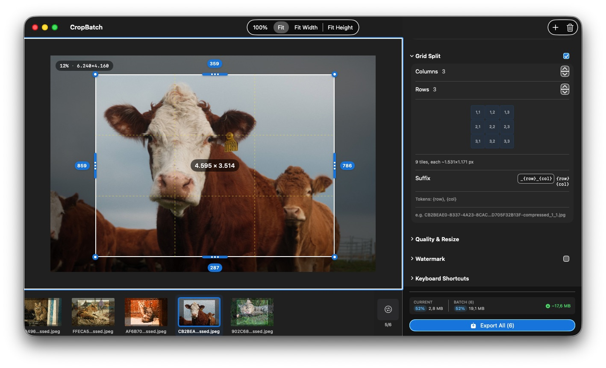
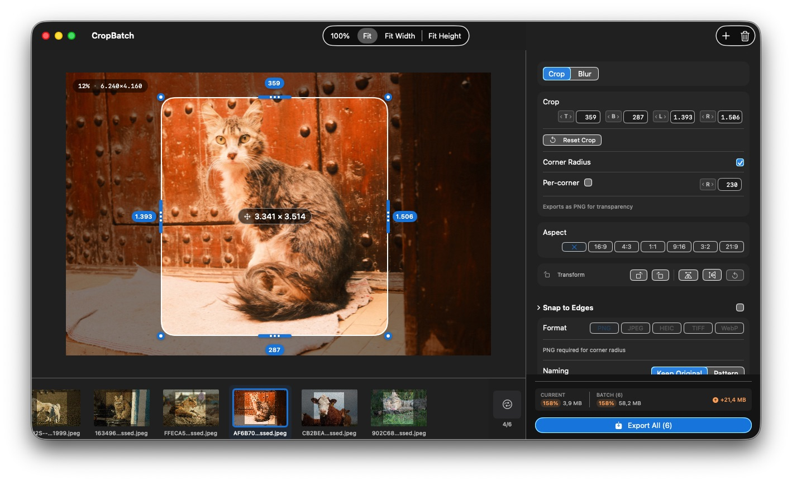
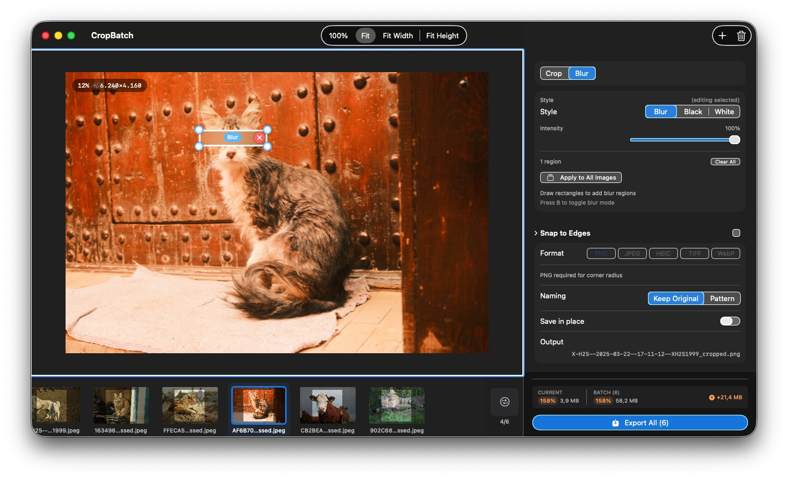
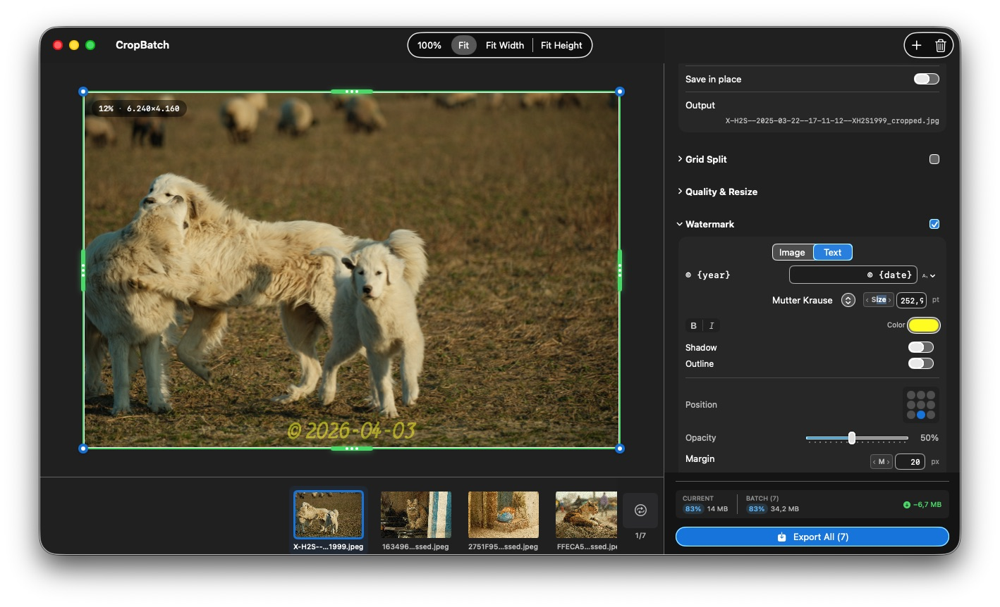
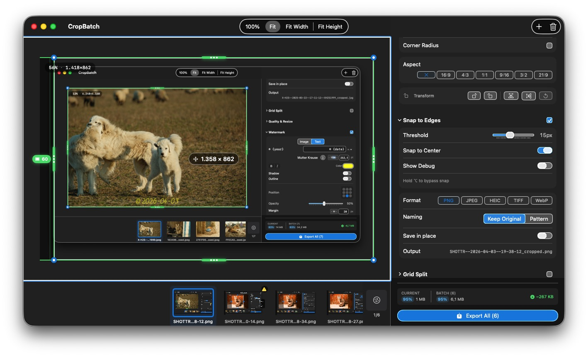

#  CropBatch

A macOS app for batch cropping images with configurable edge trimming.


[](https://github.com/Xpycode/CropBatch/releases/latest)


## Screenshots


*Grid Split — divide cropped images into tiles with configurable rows and columns*


*Corner Radius — round corners with per-corner control, auto-exports as PNG*


*Blur — redact sensitive areas with adjustable intensity*


*Watermark — text or image overlays with variables, color, shadow, and outline*


*Snap-to-Edge — crop handles snap to detected element boundaries in screenshots*


*Edge detection debug view — visualize all detected edges*

## Features

- **Batch Processing** — Import multiple images via drag & drop or file browser
- **Visual Crop Editor** — Draggable handles on the image preview
- **Grid Split** — Divide cropped images into rows and columns with customizable tile naming
- **Save in Place** — Overwrite originals directly, no folder picker needed
- **Corner Radius** — Round corners with per-corner control (auto-switches to PNG)
- **Blur Regions** — Blur sensitive areas with adjustable intensity
- **Watermarks** — Add image or text overlays with position, opacity, color, shadow, and outline
- **Snap-to-Edge** — Crop handles snap to detected UI element boundaries
- **Auto-Update** — Check for updates from the app menu
- **Scrubber Controls** — Drag the T/B/L/R labels to quickly adjust crop values
- **Aspect Ratio Guides** — 16:9, 4:3, 1:1, 9:16, 3:2, 21:9 overlays
- **Multiple Export Formats** — PNG, JPEG, HEIC, TIFF, WebP
- **Resize Options** — Exact size, max width/height, or percentage scaling
- **Flexible Naming** — Keep original names with suffix, or use patterns
- **File Size Estimation** — Preview output size for current file and batch
- **Keyboard Shortcuts** — Arrow keys for navigation, Shift+Arrow for crop adjustment

## Installation

1. Download `CropBatch-1.4.dmg` from [Releases](https://github.com/Xpycode/CropBatch/releases/latest)
2. Open the DMG and drag CropBatch to Applications
3. Launch from Applications folder

## Usage

1. **Import** — Drop images onto the window or click Import Images
2. **Crop** — Drag handles on the preview, or scrub the T/B/L/R controls
3. **Configure** — Set format, naming, grid split, and resize options
4. **Export** — Click Export All to save cropped images

### Keyboard Shortcuts

| Shortcut | Action |
|----------|--------|
| <- -> | Navigate images |
| Shift Arrow | Adjust crop |
| Shift+Option Arrow | Uncrop (expand) |
| Shift+Ctrl Arrow | Adjust by 10px |
| Cmd+1/2/3/4 | Zoom modes |
| S | Toggle snap-to-edge |
| B | Toggle blur tool |

## Building from Source

Requires Xcode 16+ and macOS 15.0+

```bash
git clone https://github.com/Xpycode/CropBatch.git
cd CropBatch/01_Project
xcodebuild -scheme CropBatch -configuration Release
```

## License

MIT
